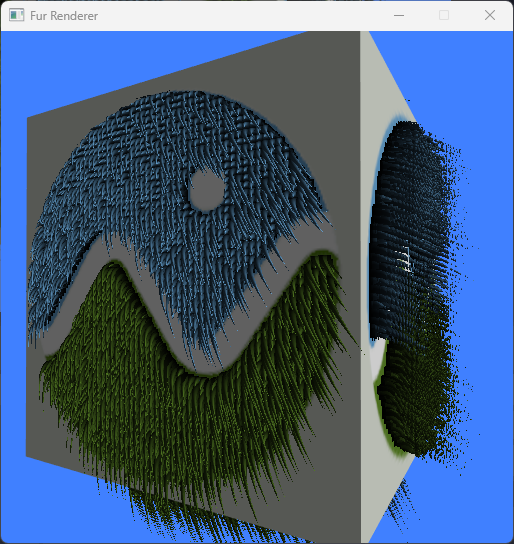
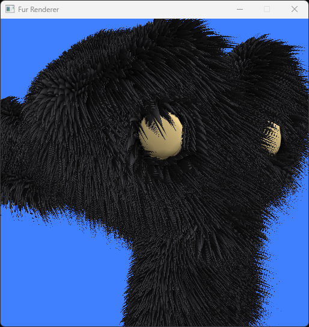
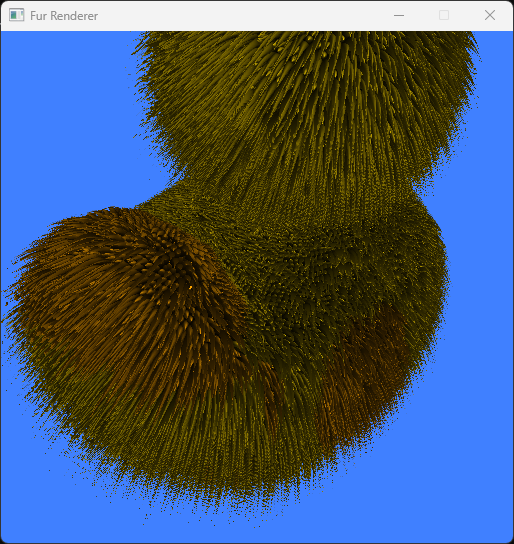

# Fur Rendererer (WIP)

Fur rendering via shell texturing.





## Requirements

1. CMake 3.26+
2. Ninja 1.11+
3. C++20 compiler
4. OpenGL 4.6 capable GPU

## Build

```
$ cmake -G Ninja -B build
$ cmake --build build
```

## Post-build

Copy assets once into the executable directory.

```
$ cd <PROJECT_BUILD_DIR>
$ ninja copy-assets
```

## Running

```
$ renderer.exe
$ renderer.exe models\suzanne\Suzanne.gltf
$ renderer.exe models\duck_centered\Duck.gltf
```
